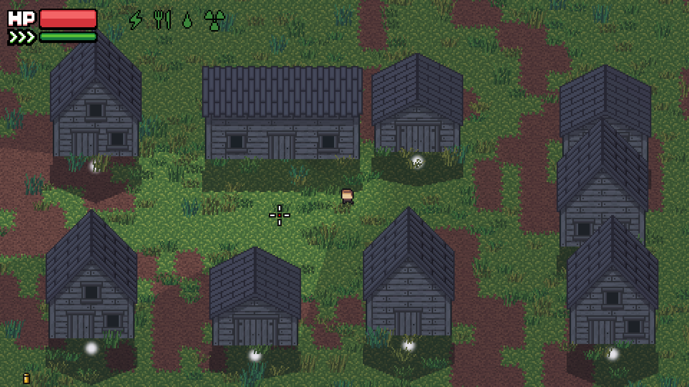
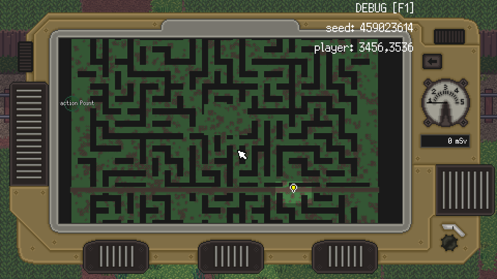
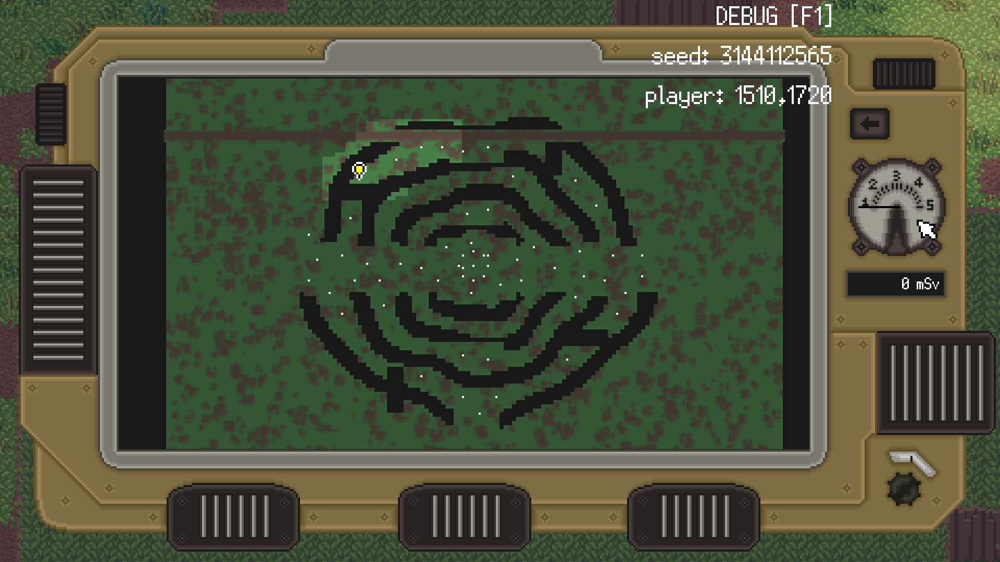
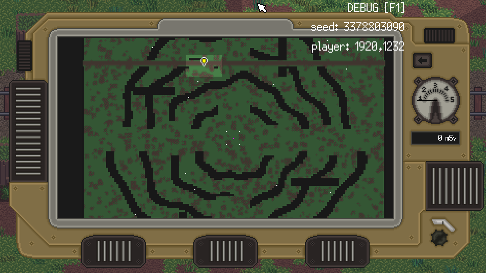

# Adjusting or creating your own ZERO Sievert map (zrsv-maps)

Python code to deserialize ZERO Sievert's .bin (map/room) files into JSON and vice versa (serialize JSON into .bin) and some custom test forest maps.

_Currently, everything on this page has been only minimally tested and is intended as proof-of-concept._

# Instructions 

To convert map .bin file to JSON: `python bin2json.py <BIN file> <JSON output>`
- e.g., `python bin2json.py r_b_forest_layout.bin r_b_forest_layout.json`

To convert JSON to a map .bin file: `python json2bin.py <JSON file> <new BIN file>`
- e.g., `python json2bin.py r_b_forest_layout.json r_b_forest_layout.bin`

Make sure to make backups if you overwrite any original .bin files. The map .bin files may be found in the game's root folder, e.g., `Program Files (x86)/Steam/steamapps/common/ZERO Sievert`.

The code has been tested with Python 3.9.16 under CYGWIN.

All .bin files of ZERO Sievert 1.3.3 have been successfully tested/compared, using the `cmp` CYGWIN/Linux program.

AI (ChatGPT) was used to help generate the Python code. If you're unfamiliar with Python, you could probably have AI run the code.

# Additional modifications

To suppress some other map generation objects, via UTMT (UnderTaleModTool) in v1.3.3's `data.win` file, apply the patches below. The code below does not result in a completely blank map; the grass/ground and train tracks are still rendered.

## Suppress NPCs

In `gml_Object_obj_map_generator_Alarm_2`, line 2879, change:
`var _amount = 12` to `var _amount = 0` – This will suppress NPC generation

Or if you want to apply it just to the forest map:
```
if (area == UnknownEnum.Value_1)
   `var _amount = 0
```
Note: This does not suppress mob generation (wolves, boars, and mutants); see below.

## Suppress other objects

To suppress other objects in `gml_GlobalScript_scr_area_data` (forest map only):

In (blank) line 7377, insert:
`area_obj_total_amount[a] = 0;` // Suppresses RNG mobs and anomalies
- This resets the counter after it's accumulated.

Alternatively, one can just "comment" out the loop in lines 7375-6.
- Because UTMT removes comments, one can preserve original code by blocking it out, e.g.,:
```
x = 0
if (x == 1) {
 for (var ll = 0; ll < array_length_2d(area_obj, a); ll++)
        area_obj_total_amount[a] += area_obj_amount[a][ll];
}
```

For buildings, trees/rocks/decor (in forest map only), change lines 7451-7452: 
```
area_different_building[a] = array_length_2d(area_building_list, a);
area_decor_number[a] = 22000;
```
into:
```
area_different_building[a] = 0 // Suppress the various buildings
area_decor_number[a] = 0` // Suppresses rocks, trees, etc.
```

Or (to preserve the original code):

```
x = 0
if (x == 1) {
  area_different_building[a] = array_length_2d(area_building_list, a);
  area_decor_number[a] = 22000;
} else {
  area_different_building[a] = 0 // Suppress the various buildings
  area_decor_number[a] = 0` // Suppresses rocks, trees, etc.
}
```

To suppress water/pond generation (again in forest only), back in `gml_Object_obj_map_generator_Alarm_2` (line 658) change:

`if (area == UnknownEnum.Value_1)` // UnknownEnum.Value_1 is the forest map

into:

`if (area == UnknownEnum.Value_1 && false)` to suppress to the water generation loops.

# Example/test maps

To use these maps, I recommend first implementing the above patches, but that's not necessary for testing purposes. Choose a file below and overwrite `r_b_forest_layout.bin`.
- The .bin files are located in the `bin/` folder.
- Their corresponding JSON files are in the `json/` folder.
- All of the example JSON were generated via AI (ChatGPT).
- These are all unpolished/proofs-of-concept. 

These are the more interesting ones:
- `forest_compact_4x4_clustered_blocks.bin` – A custom village* in the center of the forest (where the original village is located) 
- `forest_cliff_maze_narrow.bin` – A "maze" using cliff walls 
- `forest_fence_maze.bin` – A maze using fences*
- `forest_quarry_compact_dense_enemies.bin` – A quarry/arena populated with enemies 
- `forest_quarry_hunters_watchers.bin` – Another (wider) quarry/arena populated with enemies <br/> 

\* = the test objects do not show in the PDA minimap

Other test maps available in the `bin/` and `json/` folders. I have not yet played around with the other maps (camp, mall, etc.), except for confirming the Python code can regenerate the original .bin files.

You will likely encounter an error pop-up dialog (VertexBuilderM.cpp), but it doesn't crash the game.

# Creating maps yourself via AI

Because the above maps were generated as part of a long ChatGPT thread, I'm not fully sure what (files) you would need to give AI along with your prompt, for it to learn the map structure and populate/generate your own map. At minimum, it suggests:
1. The full forest JSON – so it can learn many map components. The JSON of the original forest map is not provided here. You can easily create your own by using the `bin2json.py` code on the `r_b_forest_layout.bin` file.
   - If you're unfamiliar with Python, you could give AI the `bin2json.py` and the forest map .bin file, as part of your prompt.
2. Some (or all) of the above example JSONs.
3. The `npc.json` file found in `ZS_vanilla/gamedata` – if you want your map populated with any NPCs or mobs.

After AI produces a JSON file, convert it into a .bin file (AI could probably do that for you too) and copy/overwrite `r_b_forest_layout.bin`.

My other GitHub ZERO Sievert resources:
- [Loot goblin tips](https://github.com/RolandD19/zrsv-loot-goblin) -- Tables and tips if you want to maximize your loot
